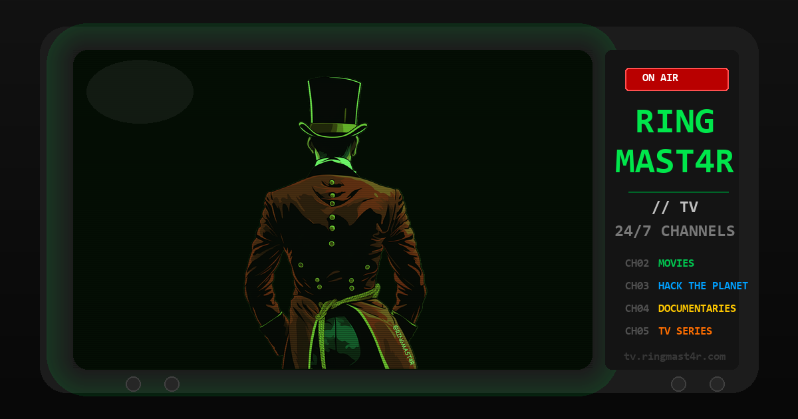

`Web` [`Docker`](https://www.docker.com/) [`ErsatzTV`](https://ersatztv.org/) `IPTV` - Run your own 24/7 cable TV station from your media library: themed channels, a Prevue-style guide, and a CRT-green web player. Built on ErsatzTV.

 

---

# RINGMAST4R // TV

Turn your own media library into a 24/7 cable TV station: themed channels that run
around the clock, a Prevue-style scrolling guide on channel 1, and a CRT-green web
player you can open on anything with a browser. You join every show mid-program,
like real cable. There is no on-demand, no pause, no library browsing. It is TV.

Built on [ErsatzTV](https://ersatztv.org/) (the fake-live-TV engine), [hls.js]
(browser playback), nginx, and Docker. This repo is the full recipe: the player,
the proxy config that makes browser playback actually work, channel-building
SQL, a tag taxonomy, a commercials downloader, and every gotcha that cost us a
weekend so it does not cost you one.

## `> what_you_get`

- 24/7 channels built from folders or tag queries (Movies, Horror, Cartoons,
  Sci-Fi, Westerns, Commercials, whatever your library supports).
- Channel 1 is a client-side TV guide: NOW/NEXT per channel, live clock,
  auto-scroll, built from the engine's XMLTV feed, zero transcode cost.
- A watch page with channel flipping (arrows, number keys with a digit buffer so
  99 works), mobile drawer, tap-to-unmute, an on-screen status overlay that says
  WHY a channel is dark, and console logging for every tune.
- Schedules are pinned to the wall clock and cost nothing until someone tunes
  in; video only transcodes while somebody is watching.
- Optional: a retro commercials channel fed from archive.org (script included).

## `> quickstart`

1. Install Docker (with the NVIDIA container toolkit if you have a GPU).
2. Clone this repo and edit `docker-compose.yml`: point the media volume at your
   library (read-only, and point at subfolders, never a drive root).
3. Edit `player/default.conf`: put your LAN IP (and public hostname if you have
   one) into the `sub_filter` list. This step is what makes HLS work in a
   browser; the comments in the file explain the trap.
4. `docker compose up -d`
5. Open the engine UI at `http://<host>:8409`, add your media as a library,
   let it scan, then build channels (UI, or SQL recipes in
   [docs/CHANNELS.md](docs/CHANNELS.md)).
6. Watch at `http://<host>:8410`.

Full walkthrough with channel SQL, schedules and troubleshooting:
[docs/SETUP.md](docs/SETUP.md).

## `> the_one_rule`

**Never scan the library and stream at the same time if your media sits on a
slow filesystem** (ntfs-3g FUSE, some network mounts). Both are heavy I/O; on a
single-threaded FUSE driver they starve each other and can take the whole host
down. Scan with the player off, then stream. War story and recovery steps in
[docs/GOTCHAS.md](docs/GOTCHAS.md).

## `> hardware_reality_check`

| Setup | Experience |
|-------|-----------|
| Any x86 box, CPU only | Works. Cap the transcode profile at 480p veryfast and exclude 4K sources; software x264 cannot do 4K live. 480p is period-correct for the CRT aesthetic anyway. |
| NVIDIA GPU (NVENC) | 720p/1080p live transcode is effortless. Use the `-nvidia` image. One mid-range card handles many concurrent channels. |
| Media on ext4/xfs/zfs | No special care needed. |
| Media on ntfs-3g / FUSE | Read the one rule above. Seriously. |

Match the transcode resolution to your sources: if most of your library is SD,
a 1080p profile just upscales noise and wastes bandwidth.

## `> repo_layout`

| Path | What |
|------|------|
| `docker-compose.yml` | Engine + player, one command up |
| `player/index.html` | The watch page (single file, no build step) |
| `player/default.conf` | nginx: static page + `/iptv/` proxy + the URL rewrite that makes HLS work on LAN and tunnel |
| `docs/SETUP.md` | Full build walkthrough |
| `docs/CHANNELS.md` | Channel recipes: folder collections and tag-driven SmartCollections, raw SQL included |
| `docs/GOTCHAS.md` | Every trap we hit, with fixes |
| `docs/TAG-TAXONOMY.md` | A locked tag vocabulary (TMDB-aligned) so channels stay queryable |
| `docs/COMMERCIALS.md` | The retro commercials channel |
| `scripts/dl_commercials.py` | archive.org commercials/bumpers downloader with .nfo sidecars |
| `scripts/setup-windows-shares.ps1` | Optional: feed channels from a Windows PC over SMB |

## `> going_public_optional`

The player works great LAN-only. If you expose it (for example through a
Cloudflare Tunnel to the player port), remember there is no auth built in:
anyone with the URL can watch. Gate it with your tunnel provider's access
rules, and only serve content you have the rights to distribute.

## `> credits`

[ErsatzTV](https://github.com/ErsatzTV/ErsatzTV) does the heavy lifting.
[hls.js](https://github.com/video-dev/hls.js) plays it.
[The Internet Archive](https://archive.org) supplies the retro commercials.
Aesthetic: every cable box and Prevue Guide channel of the 1990s.

MIT licensed. Build your own station.

---

